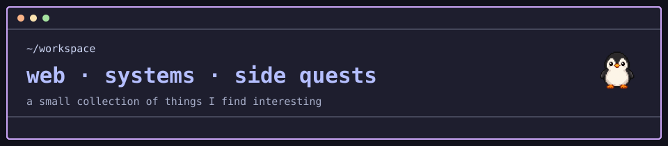

  

I like making things that work nicely, from the interface people see to the
systems quietly keeping it running.

### Things I enjoy working with

- 🖥️ Frontend and web UX
- ⚙️ Backend services and APIs
- 📦 Docker, Kubernetes, GitOps, Terraform and Ansible
- 🏠 Self-hosting and homelab experiments

Currently making things, learning things, and drinking hot chocolate. 🐧
